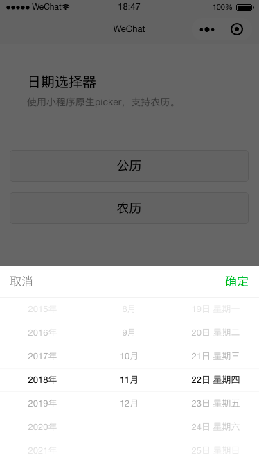
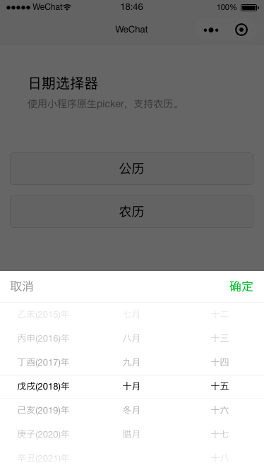

# miniprogram-datepicker

forked from [pithyone/miniprogram-datepicker](https://github.com/pithyone/miniprogram-datepicker)

小程序日期选择器，使用小程序原生picker，支持农历。

> 使用此组件需要依赖小程序基础库 2.2.1 以上版本，同时依赖开发者工具的 npm 构建。具体详情可查阅[官方 npm 文档](https://developers.weixin.qq.com/miniprogram/dev/devtools/npm.html)。

## 使用效果



## 使用方法

1. 安装 datepicker

```
npm install --save @carpenter/miniprogram-datepicker
```

2. 在需要使用 datepicker 的页面 page.json 中添加 datepicker 自定义组件配置

```json
{
  "usingComponents": {
    "datepicker": "@carpenter/miniprogram-datepicker"
  }
}
```

3. WXML 文件中引用 datepicker

datepicker 提供`<slot>`节点，用于承载组件引用时提供的子节点。

``` xml
<datepicker value="{{solar}}" bindchange="bindSolarChange">
    <button type="default">公历</button>
</datepicker>
<datepicker value="{{lunar}}" chinese="{{true}}" bindchange="bindLunarChange" picker-class="weui-btn">
    <button type="default">农历</button>
</datepicker>
```

**datepicker的属性介绍如下：**

| 属性名                   | 类型         | 默认值                 | 说明                                                       |
|-------------------------|--------------|-----------------------|-----------------------------------------------------------|
| value                   | String       | ''                    | 表示选中的日期，格式为"YYYY-MM-DD"                           |
| chinese                 | Boolean      | false                 | 是否农历                                                   |
| picker-class            | String       |                       | 外部样式类                                                 |
| bindchange              | EventHandle  |                       | value 改变时触发 change 事件，event.detail = {value, data} |


> value = 2018-11-22  
> data
``` json
{
  "Animal": "狗"
  "IDayCn": "十五"
  "IMonthCn": "十月"
  "Term": "小雪"
  "astro": "射手座"
  "cDay": 22
  "cMonth": 11
  "cYear": 2018
  "gzDay": "戊午"
  "gzMonth": "癸亥"
  "gzYear": "戊戌"
  "isLeap": false
  "isTerm": true
  "isToday": true
  "lDay": 15
  "lMonth": 10
  "lYear": 2018
  "nWeek": 4
  "ncWeek": "星期四"
}
```
